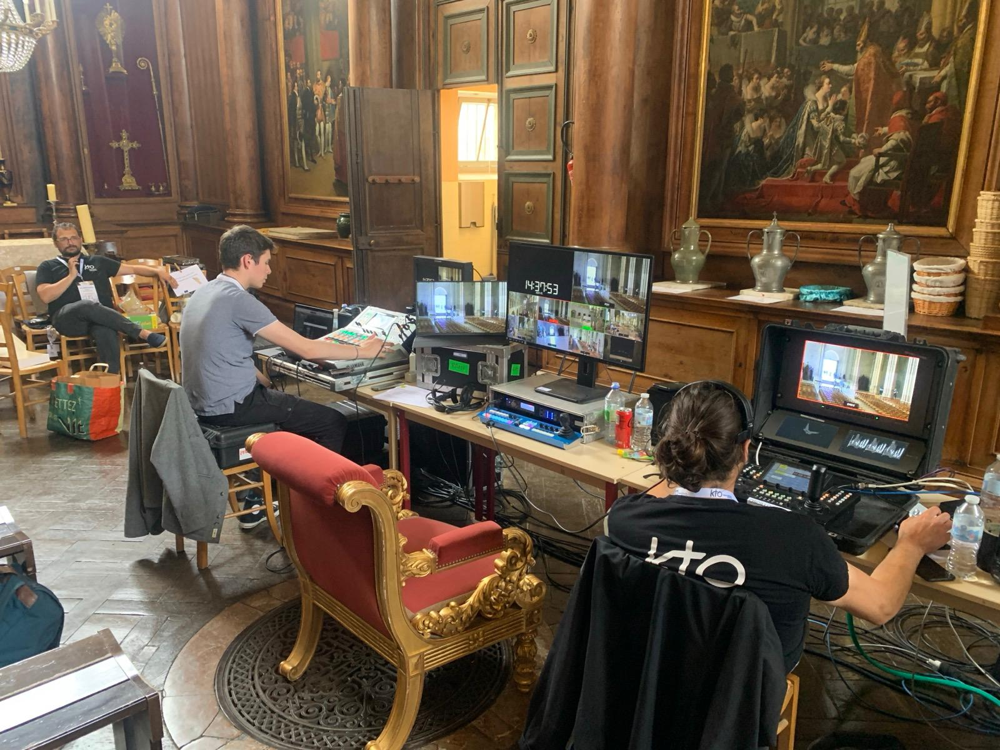

Le jeudi 25 juillet, à la veille du début des Jeux Olympiques de Paris 2024, a lieu une veillée de bénédiction des athlètes en la basilique-cathédrale de Saint-Denis. Lors de cette célébration, une attention particulière sera accordée à l'équipe olympique des réfugiés, qui concoure sous le drapeau du Comité international olympique (CIO). Ces athlètes, 36 cette année, ont été forcés de quitter leur pays d'origine pour leur propre sécurité.

